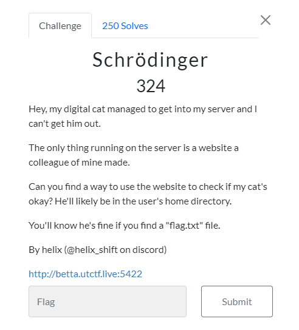
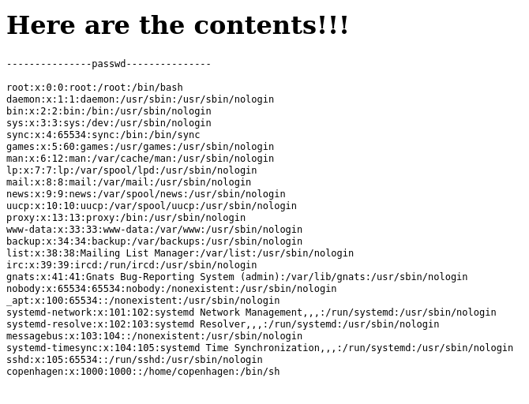
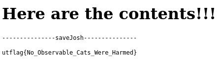

<h1>Welcome to my Writeup of the UTCTF 2024 Schrödinger challenge</h1>

To get started let's first take a look at the challenge description to see if there are any clues on how to solve it.

Other than a digital cat being stuck in a server theres one interesting detail that stands out in this description. It mentions that he is likely in the home directory of the server and we'd supposedly know hes fine if we could just locate the flag.txt file, which is what were looking for anyway, what a neat coincidence!  

Obviously we want nothing to happen to the cat either so let's be the hero they need and save him.

Once we open up the webpage we're greeted by a mostly empty page save for a file input, an "Upload File" button and a big header saying "Upload a ZIP file here, and I will show you what is inside". And that is precisely what this website does it allows you to upload a zipped file and when you click on the button it shows you the content.  

So what gives? Is there really a way to access a file that we're not supposed to which may not even be in the same directory, or is Josh (the cat) lost <i><b>forever</b></i>?  
As it turns out, as long as the input is not properly checked and sanitized to prevent this sort of attack, there is a way, and for that were going to need a Symbolic link.  

Usually a file contains useful data so that when you click on it, it may open up an editor with some text or execute some code but a Symlink is different. It doesn't contain any content itself, instead it holds the path to another file that we want to access like a shortcut to it. So if we wanted to access a file in the target system we could craft a Symlink that leads to that file on their system and have the website return its content to us.  

Does that mean we can just make a quick Symlink that leads to the flag and call it a day? Unfortunately theres one more thing we have to consider first.  
The description tells us that the cat is in the users home directory, the user in this case being the server the website is running on, which means the path to the flag.txt file is /home/{users name}/flag.txt so before we figure out the name of the user the flag is located in we wont be able to make a Symlink that leads to it.  

Fortunately for us there is a folder in the root of a linux system called "etc", in it there are important system-wide configuration files but for this case only one file is of interest to us and that is the passwd file, it stores user login information and if we could get a hold of its contents we would have everything we need to get to the flag. 

But oh no! We're not usually supposed to have access to this important file containing secret information, whatever will we do! Let's get to work.   

<h2>The Exploit</h2> 

First up let's open a terminal window and move into the Desktop directory with the command "cd Desktop" so that all the files we create will be easily accessible on the desktop.  

Now lets create our first Symlink. We've already established that in order to find the username we need to access the file located at /etc/passwd so lets craft a Symlink file that leads exactly there with the following command:  

  

ln meaning "create link" and the -s option signifying that we're trying to create a Symlink and not a hard link, make sure not to forget it.  
But we can't upload the file like this, since the website will only accept zipped files we need to zip it like so:  

  

The -y option tells zip to store the Symlink as a Symlink instead of following it and storing the content it leads to. Then we specify a name for the zipped file and which file we want to be zipped, in this case passwd.  
Now all we need to do is upload it to the website and see what it returns to us.  

  

Awesome! Among these users there is one that stands out in particular since it's not by default part of a linux machine, looks like we've found our username. 
So now let's move on to the flag itself. 

  

Just like before we create a Symlink except this time it leads to /home/copenhagen/flag.txt and again we need to zip it so we can upload it to the website.  

  

And now when we upload it to the website...

  

We get the flag! (and save Josh of course)
